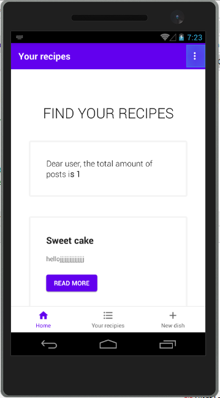
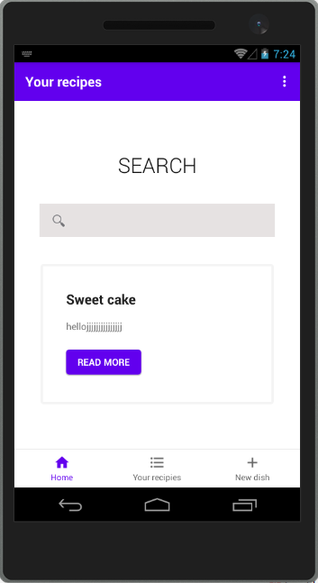
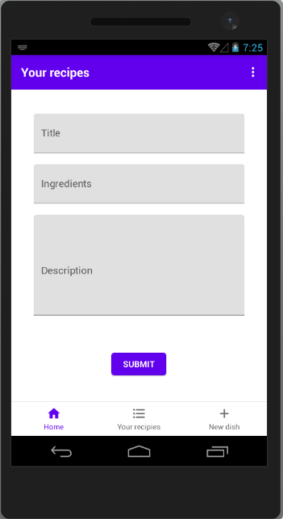

# Android app

I have developed the app, where the user can add, update and delete recipies.

## Techonologies
* Java
* RxJava
* Firebase

## How to run the app
In order to run the app, android studio and realtime database must be setted up. In addition, to properly run the app, firebase authentication (email and password) must be enabled.

> 
> 
> 

